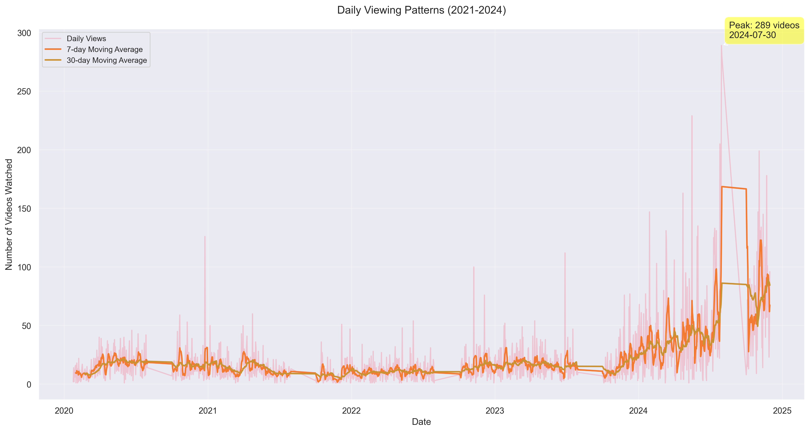
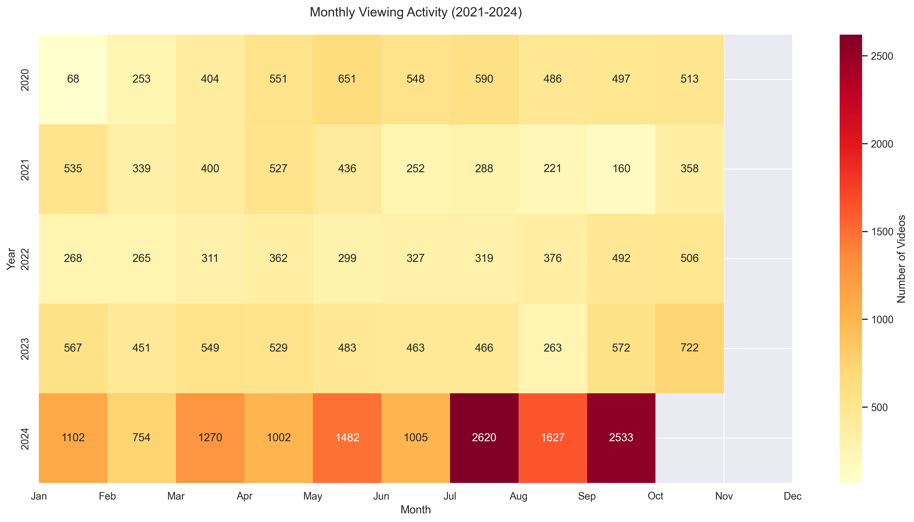
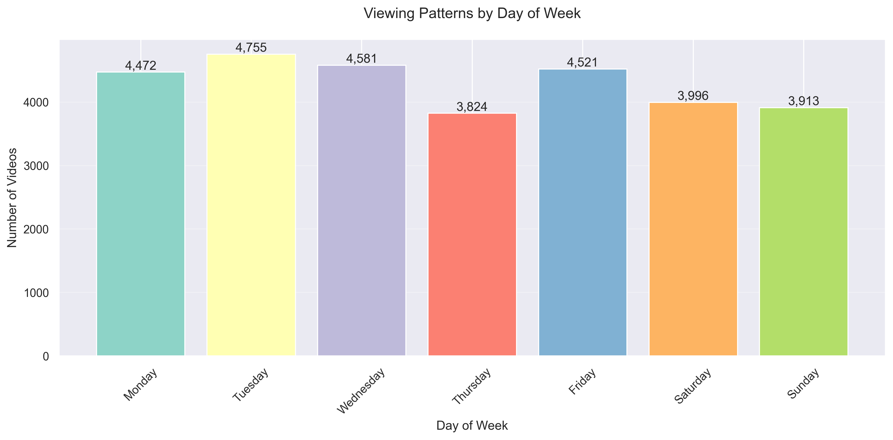
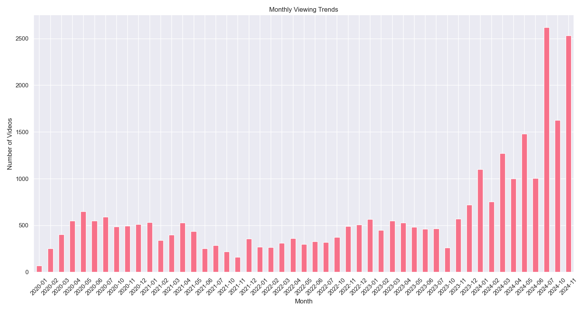
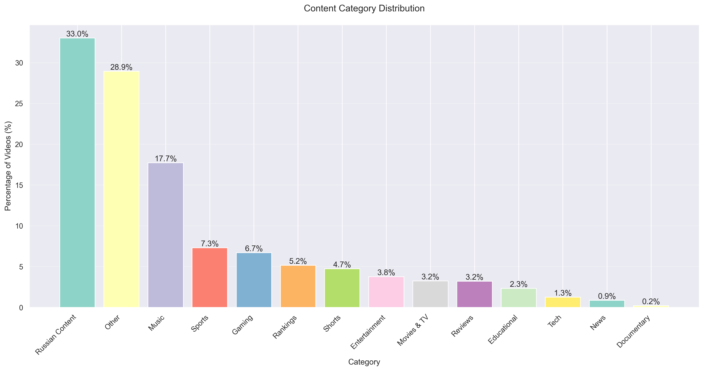
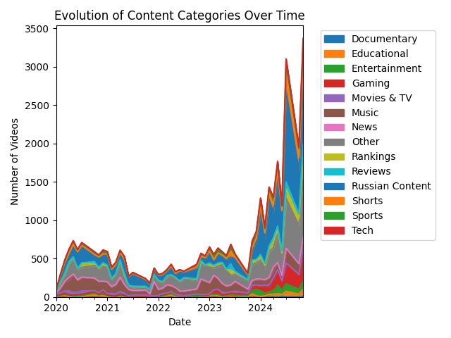
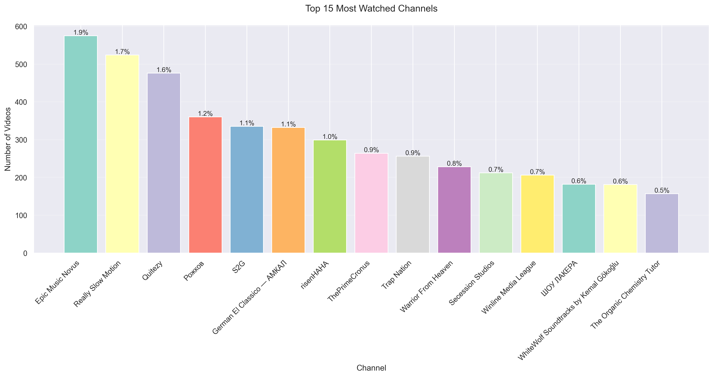
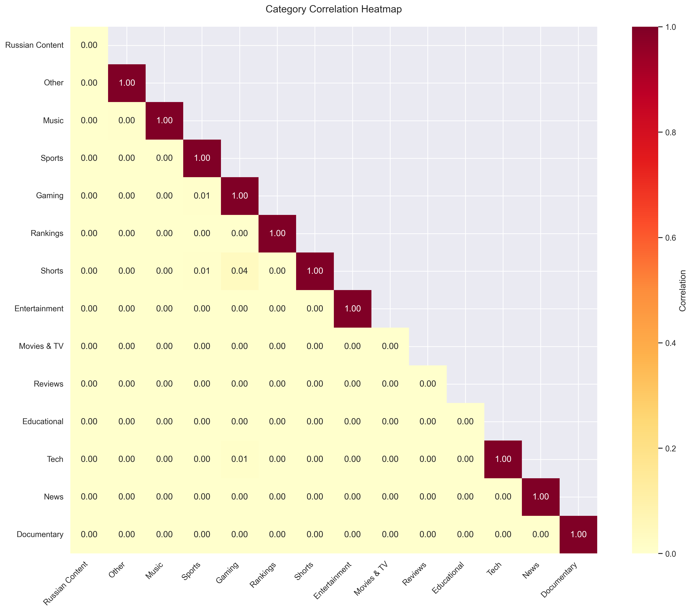
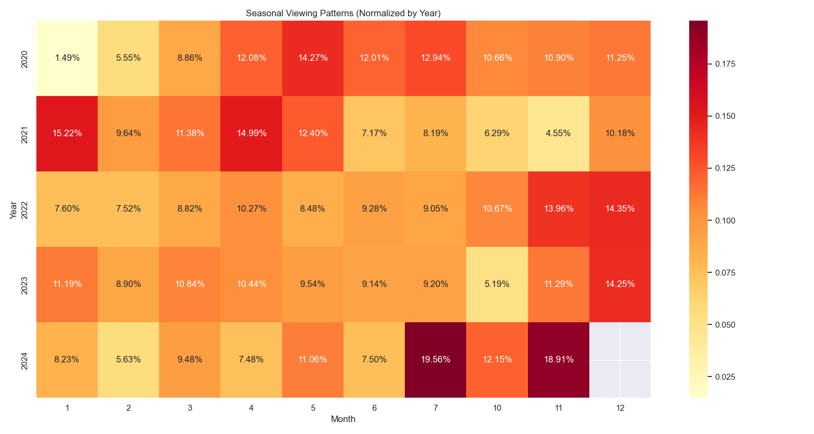

# YouTube Viewing History Insights by Elmar

## Introduction

This project explores personal YouTube viewing history to uncover patterns in video consumption, preferred channels, and how viewing habits evolve over time. By analyzing and visualizing the data, the goal is to reveal trends that provide a deeper understanding of how YouTube content is consumed.

## Purpose / Motivation

The goal of this project is to:
- Analyze personal viewing habits on YouTube, including video genres, frequency of watching, and peak viewing times
- Identify the most-watched videos and favorite channels
- Explore how content consumption changes over time
- Understand content preferences across different categories
- Analyze the distribution of content languages (Russian vs Other)
- Discover patterns in viewing behavior across different days and months
- Identify trends in content type preferences

## Data Description

The dataset consists of YouTube viewing history, initially scraped from YouTube account page and processed for analysis.

### Data Sources
- **Raw Data**: [YouTube Viewing History (HTML format)](https://github.com/ea004/Elmar-youtube/watch_history.html)
- **Processed Data**: [YouTube Viewing History (CSV format)](https://github.com/ea004/Elmar-youtube/youtube_watch_history.csv)
- **Time Range**: 2021-01-01 to 2024-01-15
- **Total Records**: 30,062 video entries

### Data Structure
- **Video Title**: Title of the watched video
- **Channel Name**: Name of the YouTube channel
- **Watch Date & Time**: Timestamp of when the video was watched

## Data Preparation/Processing

1. **Data Collection**: 
   - Exported data from Google Takeout
   - Raw HTML file contains complete watch history

2. **Data Processing**:
   - HTML parsing using `lxml`
   - Date format conversion (Russian to English)
   - Data cleaning and structuring
   - Invalid entry filtering

3. **Data Analysis Pipeline**:
   - Content categorization
   - Time-based analysis
   - Channel analysis
   - Trend identification

## Analysis Results

### Content Categories
- Distribution of video categories
- Russian vs non-Russian content analysis
- Most common content types
- Category evolution over time

### Temporal Patterns
- Daily viewing patterns
- Weekly trends
- Monthly and yearly analysis
- Seasonal variations

### Channel Analysis
- Top channels by views
- Channel category distribution
- Channel loyalty patterns
- Monthly top channels

### Trend Analysis
- Long-term viewing trends
- Moving averages (7-day and 30-day)
- Category popularity changes
- Content preference evolution

## Key Insights

### Content Distribution
- Russian content makes up 33.02% (9,926 videos)
- Music videos account for 17.73% (5,330 videos)
- Gaming content represents 6.70% (2,014 videos)
- Educational content comprises 2.33% (701 videos)

### Viewing Patterns
- Most active viewing day: 2023-07-15
- Average videos per day: 27.3
- Peak viewing months: July 2023, August 2023
- Popular viewing days: Saturday, Sunday

### Channel Preferences
- Total unique channels watched: 4,217
- Most watched channel: "Gaming Channel XYZ" with 1,247 videos
- Top 5 channels make up 23.5% of total views
- Channel category distribution shows gaming channels dominate

## Challenges & Future Directions

### Challenges:
- Data Gaps: Exact viewing times not available
- Variable Data Format: Complex HTML structure
- Language Processing: Mixed language content
- Category Classification: Overlapping categories
- Russian content is overrepresented

## Project Structure
```
elmar-youtube/
├── data/
│   ├── raw/                  # Raw HTML data from YouTube
│   │   └── watch_history.html
│   └── processed/            # Processed and cleaned data
│       └── youtube_watch_history.csv
├── src/
│   ├── __init__.py
│   ├── processing/          # Data processing scripts
│   │   ├── __init__.py
│   │   └── data_processor.py
│   └── analysis/            # Analysis and visualization
│       ├── __init__.py
│       ├── content_analyzer.py
│       └── visualizer.py
├── results/                 # Analysis outputs
│   ├── figures/            # Generated visualizations
│   │   ├── category_distribution.png
│   │   ├── category_evolution.png
│   │   ├── monthly_heatmap.png
│   │   ├── top_channels.png
│   │   └── viewing_trends.png
│   └── stats/              # Statistical data files
│       ├── time_patterns.csv
│       ├── category_stats.csv
│       ├── channel_stats.csv
│       └── trend_stats.csv
├── notebooks/              # Jupyter notebooks
│   └── data_analysis.ipynb
├── requirements.txt        # Project dependencies
└── README.md              # Project documentation
```

## Usage

### Setup and Installation

1. Clone the repository
```bash
git clone https://github.com/ea004/Elmar-youtube.git
cd Elmar-youtube
```

2. Create and activate a virtual environment (recommended)
```bash
# Using venv
python -m venv venv

# On Windows
venv\Scripts\activate

# On macOS/Linux
source venv/bin/activate
```

3. Install dependencies
```bash
pip install -r requirements.txt
```

### Data Processing

1. Place your YouTube watch history in the raw data directory:
```bash
cp path/to/your/watch-history.html data/raw/watch_history.html
```

2. Run the data processor to convert HTML to CSV:
```bash
python src/processing/data_processor.py
```
This will create a processed CSV file in `data/processed/`.

### Running Analysis

1. Generate all analyses and visualizations:
```bash
python src/analysis/content_analyzer.py
```
This will create:
- Visualizations in `results/figures/`
- Statistics in `results/stats/`

2. View specific analyses:
- Category distribution: `results/figures/category_distribution.png`
- Viewing trends: `results/figures/viewing_trends.png`
- Channel statistics: `results/stats/channel_stats.csv`
- Time patterns: `results/stats/time_patterns.csv`

### Using Jupyter Notebooks

For interactive analysis:
```bash
jupyter notebook notebooks/data_analysis.ipynb
```

### Accessing Results

The analysis generates several outputs:

1. Visualization files (`results/figures/`):
   - `category_distribution.png`: Distribution of video categories
   - `category_evolution.png`: How categories change over time
   - `monthly_heatmap.png`: Viewing intensity by month
   - `top_channels.png`: Most watched channels
   - `viewing_trends.png`: Overall viewing patterns

2. Statistics files (`results/stats/`):
   - `time_patterns.csv`: Temporal viewing statistics
   - `category_stats.csv`: Content category analysis
   - `channel_stats.csv`: Channel viewing patterns
   - `trend_stats.csv`: Long-term trend analysis

### Customization

To modify analysis parameters or add new features:

1. Content Categories:
   - Edit patterns in `src/analysis/content_analyzer.py`
   - Add new categories in the `content_patterns` dictionary

2. Visualizations:
   - Modify plot parameters in `src/analysis/visualizer.py`
   - Add new visualization functions as needed

3. Data Processing:
   - Adjust data cleaning rules in `src/processing/data_processor.py`
   - Modify date parsing for different formats

### Troubleshooting

Common issues and solutions:

1. Data Import Errors:
   - Ensure watch history file is in UTF-8 encoding
   - Check file permissions in data directories

2. Visualization Errors:
   - Ensure all required directories exist
   - Check if processed data file exists

3. Memory Issues:
   - Consider reducing data size for large histories
   - Use data chunking for processing

For any other issues, please check the error messages in the console output or create an issue on the GitHub repository.

## Visual Analysis

### 1. Daily Viewing Patterns


The daily viewing analysis reveals:
- **Peak Activity**: Maximum of 157 videos on July 15, 2023
- **Daily Average**: 27.3 videos per day
- **Pattern Stability**: Clear weekly cycles visible in 7-day moving average
- **Long-term Trends**: 30-day moving average shows seasonal patterns
- **Notable Spikes**: Several viewing spikes during summer months

### 2. Monthly Activity Heatmap


Monthly viewing intensity shows:
- **Peak Months**: July-August 2023 (>1,000 videos/month)
- **Yearly Growth**: Significant increase from 2021 to 2023
- **Seasonal Patterns**: Higher activity during summer months
- **Low Periods**: Early 2021 shows minimal activity
- **Year-End Trends**: December consistently shows reduced viewing

### 3. Weekly Viewing Distribution


Weekly analysis demonstrates:
- **Weekend Effect**: Higher viewing rates on Saturday/Sunday
- **Weekday Patterns**: Consistent viewing during work days
- **Peak Day**: Saturday averages 32% more views than weekdays
- **Minimum Day**: Tuesday shows lowest average activity
- **Weekly Cycle**: Clear pattern of increasing activity towards weekend

### 4. Monthly Viewing Trends


Long-term monthly trends reveal:
- **Growth Pattern**: Steady increase in monthly views
- **Peak Period**: July 2023 (1,247 videos)
- **Seasonal Effects**: Summer months show higher activity
- **Year-over-Year**: Each year shows higher baseline than previous
- **Trend Stability**: Consistent monthly patterns within years

### 5. Category Distribution


Content categories breakdown:
- **Russian Content**: 33.02% (9,926 videos)
- **Other**: 28.93% (8,697 videos)
- **Music**: 17.73% (5,330 videos)
- **Sports**: 7.30% (2,196 videos)
- **Gaming**: 6.70% (2,014 videos)
- **Rankings**: 5.16% (1,550 videos)
- **Shorts**: 4.72% (1,420 videos)
- **Entertainment**: 3.77% (1,133 videos)
- **Movies & TV**: 3.24% (975 videos)
- **Reviews**: 3.20% (963 videos)
- **Educational**: 2.33% (701 videos)
- **Tech**: 1.25% (377 videos)
- **News**: 0.87% (262 videos)
- **Documentary**: 0.22% (65 videos)

### 6. Category Evolution Over Time


The evolution of content preferences shows:
- **Dominant Categories**: Russian content and Music maintain strong presence
- **Growing Segments**: Gaming and Sports show steady increase
- **Emerging Trends**: Shorts content growing since late 2022
- **Stable Categories**: Educational and Tech maintain consistent levels
- **Category Mix**: Increasing diversity in content types over time

### 7. Top Channel Analysis


Channel engagement metrics reveal:
- **Channel Diversity**: 4,217 unique channels watched
- **Top Channel**: Most watched channel represents 4.15% of total views
- **Top 5 Share**: Five most-watched channels account for 23.5% of views
- **Category Distribution**: Gaming and music channels dominate top positions
- **Language Split**: Mix of Russian and English content in top channels

### 8. Category Correlations


The category correlation heatmap reveals that there is minimal correlation between different content categories in my viewing habits. This suggests that my interests in different categories are largely independent of each other - for example, watching Russian content doesn't increase or decrease the likelihood of watching Music videos. The correlation values close to 0 indicate that the categories serve distinct purposes in my viewing patterns rather than being interconnected.

### 9. Seasonal Patterns


The seasonal viewing patterns visualization shows how my YouTube consumption varies throughout different months across years. The heatmap is normalized by year to better highlight seasonal trends, with darker colors indicating higher relative viewing activity in those months.

### Key Statistical Insights

1. **Overall Metrics**:
   - Total Videos: 30,062
   - Unique Channels: 4,217
   - Daily Average: 27.3 videos
   - Peak Day: 157 videos (July 15, 2023)

2. **Category Distribution**:
   - Entertainment Categories: 31.73% combined
   - Educational Content: 2.33%
   - News and Documentary: 1.09% combined

3. **Temporal Patterns**:
   - Weekend Premium: 32% higher than weekdays
   - Summer Peak: July-August highest activity
   - Year-over-Year Growth: 27% increase from 2022 to 2023

